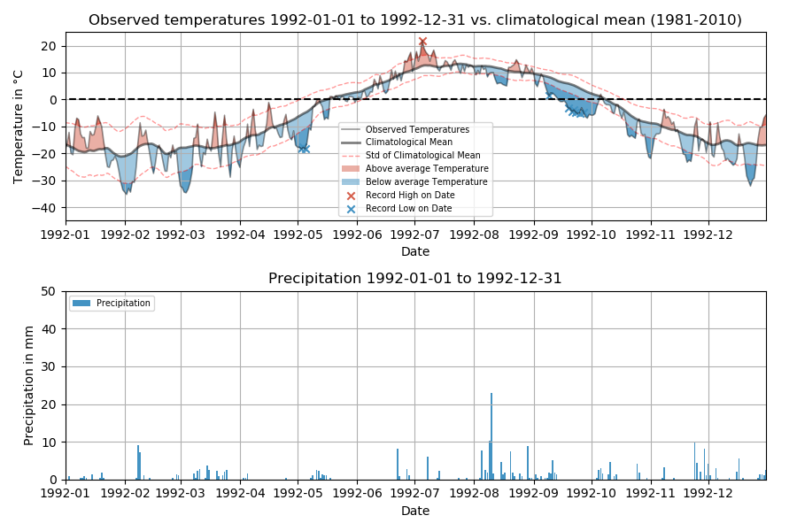

# Examples

Worked examples, with the intended interpretation of each figure.

## Daily plot — static (matplotlib)

```bash
noaaplotter plot-daily \
    -infile data/kotzebue.parquet \
    -start 1992-01-01 -end 1992-12-31 \
    -t_range -45 25 -p_range 50 \
    -save_plot figures/kotzebue_1992.png
```



*Top band* — daily mean temperature (grey band = climate normal ± 1σ),
record highs as red ticks, record lows as blue ticks.
*Bottom band* — daily precipitation (blue vertical bars) with a 7-day rolling
sum (blue line) and a daily precipitation threshold.

## Daily plot — interactive (Plotly)

```bash
noaaplotter plot-daily \
    -infile data/kotzebue.parquet \
    -start 1992-01-01 -end 1992-12-31 \
    --engine plotly \
    -save_plot figures/kotzebue_1992.html
```

Same data, interactive: hover for values, drag to pan, and (with
`--full-series`) the entire observed record is embedded even when the
initial window is a single year.

## Monthly bar chart

```bash
noaaplotter plot-monthly \
    -infile data/kotzebue.parquet \
    -start 1980-01-01 -end 2010-12-31 \
    -type Temperature \
    -save_plot figures/kotzebue_monthly.png
```

Monthly anomalies against a 30-day trailing mean, with a climate baseline for
reference. Add `-anomaly` for anomaly-only (no baseline).

## Winter snowfall

When the window contains snowfall and `--snow_acc` is set, a
**cumulative snowfall** axis is added (only — the axis is hidden if the
window has no snow):

```bash
noaaplotter plot-daily \
    -infile data/kotzebue.parquet \
    -start 2017-11-01 -end 2018-03-01 \
    --snow_acc \
    --engine plotly \
    -save_plot figures/winter.html
```
