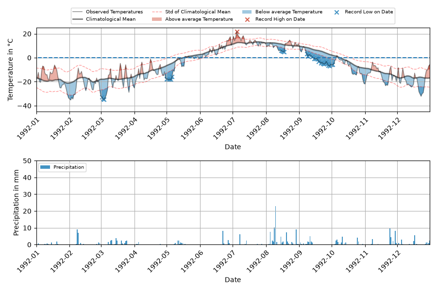
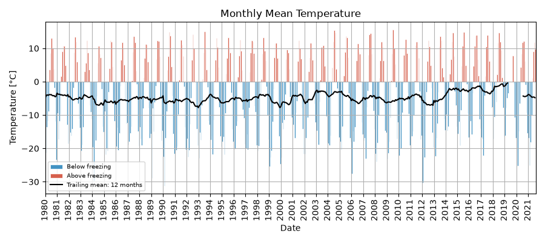
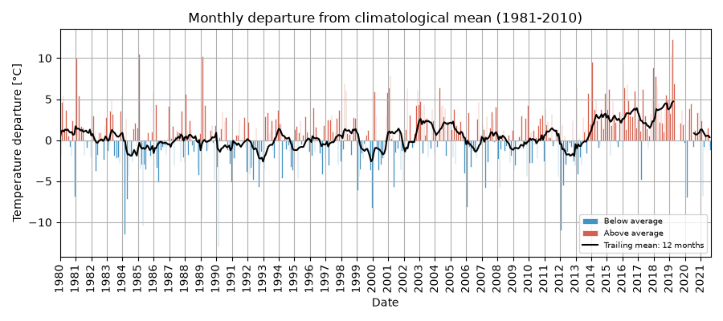
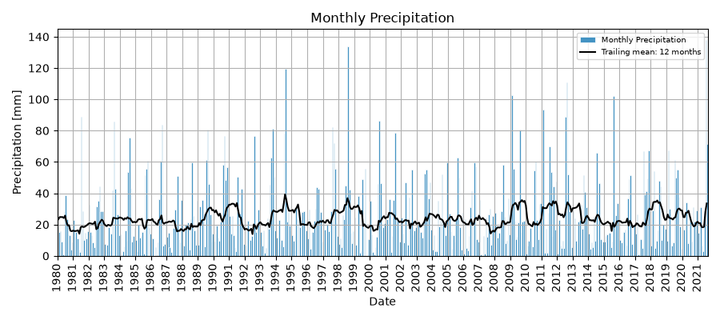
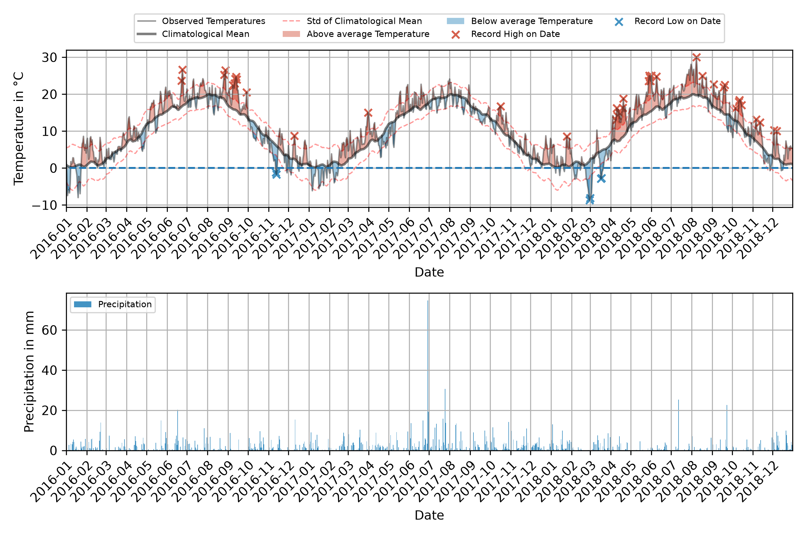

# Examples

Worked examples, with the intended interpretation of each figure.

## Daily plot — static (matplotlib)

```bash
noaaplotter plot-daily \
    -infile data/kotzebue.parquet \
    -start 1992-01-01 -end 1992-12-31 \
    -t_range -45 25 -p_range 50 \
    -save_plot figures/kotzebue_daily_1992.png
```



*Top band* — daily mean temperature (grey band = climate normal ± 1σ),
record highs as red ticks, record lows as blue ticks.
*Bottom band* — daily precipitation (blue vertical bars) with a 7-day rolling
sum (blue line) and a daily precipitation threshold.

## Daily plot — interactive (Plotly)

```bash
noaaplotter plot-daily \
    -infile data/kotzebue.parquet \
    -start 1992-01-01 -end 1992-12-31 \
    --engine plotly \
    -save_plot figures/kotzebue_daily_1992.html
```

Same data, interactive: hover for values, drag to pan, and (with
`--full-series`) the entire observed record is embedded even when the
initial window is a single year.

**Live example — Kotzebue daily, 1992 (interactive):**

<iframe src="interactive/kotzebue_daily_1992.html"
        style="width:100%; min-height:640px; border:1px solid var(--md-default-fg-color--lightest); border-radius:8px;"
        loading="lazy" title="Kotzebue daily 1992 — interactive"></iframe>

## Winter snowfall — interactive

When the window contains snowfall and `--snow_acc` is set, a
**cumulative snowfall** axis appears:

```bash
noaaplotter plot-daily \
    -infile data/kotzebue.parquet \
    -start 2017-11-01 -end 2018-03-01 \
    --snow_acc \
    --engine plotly \
    -save_plot interactive/kotzebue_daily_winter.html
```

**Live example — Kotzebue winter 2017/18 (interactive, snow accumulation):**

<iframe src="interactive/kotzebue_daily_winter.html"
        style="width:100%; min-height:640px; border:1px solid var(--md-default-fg-color--lightest); border-radius:8px;"
        loading="lazy" title="Kotzebue winter 2017/18 — interactive"></iframe>

## Monthly bar charts

Monthly averages with a 12-month trailing mean, as absolute values or anomaly
from the climate baseline (1981-2010).

Temperature, absolute:

```bash
noaaplotter plot-monthly \
    -infile data/kotzebue.parquet \
    -start 1980-01-01 -end 2021-08-31 \
    -type Temperature -trail 12 \
    -save_plot figures/kotzebue_monthly_t.png
```



Temperature, anomaly:

```bash
noaaplotter plot-monthly \
    -infile data/kotzebue.parquet \
    -start 1980-01-01 -end 2021-08-31 \
    -type Temperature -trail 12 -anomaly \
    -save_plot figures/kotzebue_monthly_t_anomaly.png
```



Precipitation, absolute:

```bash
noaaplotter plot-monthly \
    -infile data/kotzebue.parquet \
    -start 1980-01-01 -end 2021-08-31 \
    -type Precipitation -trail 12 \
    -save_plot figures/kotzebue_monthly_p.png
```



## ERA5 / reanalysis (no API key)

`noaaplotter` also pulls **ERA5 reanalysis** by coordinates. The
`open_meteo` source uses Open-Meteo's public archive — **no API key, no
account** — and is the simplest way to plot a station-less location (e.g. a
city centre, a lake, a remote site).

```bash
noaaplotter download-data --source open_meteo \
    -lat 52.4 -lon 13.05 \
    -start 1980-01-01 -end 2021-12-31 \
    -o data/potsdam_ERA5.parquet

noaaplotter plot-daily \
    -infile data/potsdam_ERA5.parquet \
    -loc "52.40,13.05" \
    -start 2016-01-01 -end 2018-12-31 \
    -t_range -5 20 -p_range 20 \
    -save_plot figures/era5_potsdam_daily.png
```



**Live example — Potsdam ERA5 daily, 2016–2018 (interactive):**

<iframe src="interactive/potsdam_era5_daily.html"
        style="width:100%; min-height:640px; border:1px solid var(--md-default-fg-color--lightest); border-radius:8px;"
        loading="lazy" title="Potsdam ERA5 daily 2016–2018 — interactive"></iframe>

*Note:* for coordinate-based data, the `-loc` / `location=` argument is the
**coordinate string** (e.g. `52.40,13.05`), not a human-readable name, because
reanalysis points have no station ID.
